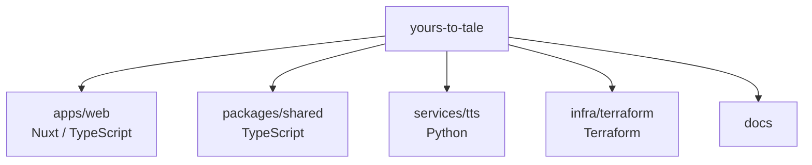

# ADR-0001: Use a monorepo for the product codebase

| Field  | Value      |
| ------ | ---------- |
| Status | Accepted   |
| Date   | 2026-08-08 |

## Context

The project consists of technologically diverse components that belong to the same product ecosystem. During the early product-validation phase, these components are expected to evolve together.

### Components

* `apps/web`: Nuxt / Vue / TypeScript web application.
* `services/tts`: Python-based TTS service (ML-focused).
* `packages/shared`: Framework-independent shared TypeScript code (domain types, DTOs).
* `infra/terraform`: Infrastructure definitions for Google Cloud and Firebase.
* `docs`: Architecture and product documentation.

### Development Environment

This is an early-stage commercial experiment primarily developed by a single engineer. There is currently no organizational need for separate repositories, independent release trains, or fine-grained access control between components.

## Decision

Use a single repository (monorepo) to manage all project components.

* **TypeScript/Node.js:** Use `npm workspaces` for `apps/*` and `packages/*`.
* **Independent Services:** `services/*` (e.g., Python-based TTS) reside in the monorepo but are **not** part of the npm workspace to keep runtimes isolated.
* **Infrastructure:** `infra/terraform` remains independent of the Node.js build system.
* **Documentation:** All project documentation is kept alongside the source code.

## Rationale

The monorepo structure primarily optimizes for developer velocity and ease of cross-cutting changes.

Key factors:
* **Operational Simplicity:** Avoids the overhead of managing multiple repositories, Git remotes, and synchronized PRs.
* **Unified Visibility:** Provides a clear view of the product's evolution and makes cross-cutting changes (e.g., updating a DTO in `shared` and its usage in `web`) easier to review.
* **Polyglot Support:** The structure acknowledges that different components use different languages and build systems without forcing a "one size fits all" approach.

## Alternatives considered

### Separate repositories per component
Dividing the project into `frontend`, `tts`, and `infrastructure` repos.
* **Advantages:** Strict ownership boundaries, independent release cycles.
* **Why not selected:** High operational friction for a single developer. The benefits of isolation do not currently outweigh the cost of coordination.

## Consequences

### Positive
* Simplified project-wide searching and documentation navigation.
* Easier management of shared TypeScript types and constants.
* Atomic changes across application and infrastructure are possible.

### Trade-offs / Risks
* **CI/CD Complexity:** The build pipeline must be configured to handle multiple runtimes and selective builds based on changed paths.
* **Tooling Sensitivity:** Some IDE or linting tools may require specific configuration to handle the mixed-language root.

### Follow-up implications
A future split remains possible if team structure, release independence, or access-control requirements justify it. The current directory structure facilitates such a migration.
