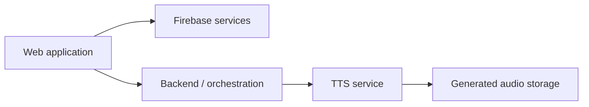

# ADR-0003: Use Firebase and Google Cloud as the primary cloud platform

| Field  | Value      |
| ------ | ---------- |
| Status | Accepted   |
| Date   | 2026-08-08 |

## Context

The platform requires a robust set of services for user management, data persistence, and audio storage. Additionally, it needs a scalable environment for a specialized Python-based TTS inference service.

### Existing Experience
The developer has significant practical experience with the Firebase ecosystem, including:
* Firebase Authentication
* Firestore (NoSQL database)
* Firebase Cloud Storage
* Firebase Cloud Functions (TypeScript)
* Firebase Hosting

## Decision

Use **Firebase** and **Google Cloud Platform (GCP)** as the primary cloud platform.

*   **Firebase:** Used for application-level services like Authentication, Firestore, and Storage.
*   **Google Cloud:** Used for broader infrastructure, specialized workloads (e.g., Cloud Run for TTS), IAM, and Artifact Registry.
*   **Relationship:** The project recognizes that Firebase is a layer on top of Google Cloud, and the two will be used complementarily.

## Rationale

The decision is primarily pragmatic, prioritizing developer productivity and leveraging existing knowledge of the Google Cloud/Firebase ecosystem.

Key factors:
*   **Expertise & Velocity:** Reusing existing Firebase knowledge avoids the steep learning curve of equivalent services on AWS or Azure.
*   **Platform Continuity:** Starting with high-level Firebase services allows for a fast start, while having the full depth of GCP available for scaling specialized components like the TTS engine.
*   **TTS Hosting Capability:** GCP's Cloud Run is a strong candidate for containerized TTS inference, supporting scale-to-zero and providing a path to GPU-backed workloads if needed.

## Alternatives considered

### AWS (Amazon Web Services)
*   **Advantages:** Massive ecosystem, industry leader.
*   **Why not selected:** Would require learning and replacing several services (Auth, Firestore equivalent) for which deep experience already exists in the Firebase ecosystem.

### Azure
*   **Advantages:** Strong enterprise integration.
*   **Why not selected:** Similar reasoning to AWS; no decisive advantage outweighs the current familiarity with GCP/Firebase.

### Firebase Only
*   **Advantages:** Maximum simplicity.
*   **Why not selected:** Likely insufficient for the specialized runtime, large model storage (5GB+), and potential GPU requirements of the TTS service.

## Consequences

### Positive
*   Unified billing, identity, and access management (IAM) across the stack.
*   Fast implementation of core features using Firebase SDKs.
*   Path to specialized infrastructure (Cloud Run/GPU) without changing providers.

### Trade-offs / Risks
*   **Vendor Coupling:** The project is coupled to the Google Cloud/Firebase ecosystem for core persistence and authentication.
*   **Service Boundaries:** Specialized workloads like TTS must be kept behind explicit boundaries to avoid leaking provider-specific details into unrelated application logic.

## Follow-up implications
The architecture should ensure that the TTS inference provider remains replaceable, even if it currently runs on Google Cloud infrastructure.
