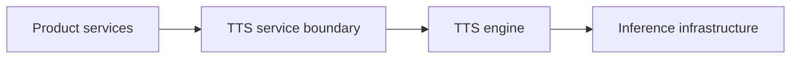

# ADR-0005: Keep the TTS engine behind a separate service boundary

| Field  | Value      |
| ------ | ---------- |
| Status | Accepted   |
| Date   | 2026-08-08 |

## Context

Text-to-speech (TTS) is a critical component of Yours to Tale, but it introduces specialized runtime requirements and dependencies that differ significantly from the primary web application.

### Proof of Concept (PoC) Findings
A proof of concept using **Qwen3-TTS (0.6B CustomVoice model)** was conducted in a Python 3.12 environment. The findings from this local Ryzen 7 5800X3D CPU-based PoC were:

| Metric            | Local PoC Value            |
| ----------------- | -------------------------- |
| Model             | Qwen3-TTS 0.6B CustomVoice |
| Cached model load | ~3.6 s                     |
| Process RAM       | ~5 GB                      |
| CPU RTF           | ~4.7–4.9                   |

*Note: RTF (Real-Time Factor) > 1 means inference is slower than real-time speech.*

### Implications
*   **Performance:** CPU inference is sufficient for batch generation but too slow for immediate interactive playback. GPU inference is likely required for production.
*   **Polyglot Requirements:** The TTS ecosystem is primarily Python/ML-based (Torch, Qwen), while the rest of the project is TypeScript-based.
*   **Orchestration:** Multi-character stories will require segmenting text and assigning different voices, which is an orchestration concern.

## Decision

Expose the TTS engine through an explicit **service boundary / API**.

*   **Isolation:** The Python/ML runtime and its heavy dependencies (multi-GB models, Torch) are isolated from the TypeScript backend.
*   **Product-Level API:** The boundary uses product concepts (text, voice, style) rather than leaking Qwen-specific parameters.
*   **Decoupled Infrastructure:** The inference service can be hosted on specialized hardware (e.g., GPU-backed Cloud Run or a dedicated VM) independently of the web application.



### Conceptual Request Example
```json
{
  "text": "Once upon a time, there was a little wolf...",
  "language": "en",
  "voice": "narrator-calm",
  "style": "expressive"
}
```

## Rationale

The service boundary protects the rest of the application from the volatility and specialized requirements of ML infrastructure.

Key factors:
*   **Model Flexibility:** Qwen3-TTS is the current choice, but the model or provider (e.g., a third-party API or a different open-source model) may change in the future.
*   **Resource Isolation:** TTS has high RAM and potentially GPU requirements; isolating it prevents these from impacting the stability or cost of the main application.
*   **Scaling Characteristics:** TTS inference has different scaling patterns than typical web requests (long-running, compute-intensive).

## Alternatives considered

### Embedding Qwen directly into the Node.js Backend
*   **Advantages:** Lower latency (no network boundary).
*   **Why not selected:** High complexity in managing Python/Node interop, coupled deployment, and risk of ML dependencies destabilizing the backend.

### Third-party Cloud TTS API only
*   **Advantages:** Zero operational overhead.
*   **Why not selected:** Conflicts with the desire for a unique, expressive voice and the preference for local-capable/open-source models to avoid deep provider lock-in.

## Consequences

### Positive
*   TTS implementation can evolve independently.
*   GPU deployment choices remain flexible.
*   Python dependencies stay isolated.

### Trade-offs / Risks
*   **Operational Overhead:** Requires deploying and monitoring an additional service.
*   **Latency:** Introduces a network boundary between the orchestration layer and the TTS engine.
*   **API Contract:** Requires maintaining a stable contract between services.

## Deferred decisions
*   **Final Protocol:** The transport layer (REST, gRPC, or Message Queue) is not yet finalized.
*   **GPU Provider:** The specific GPU hosting provider (GCP Cloud Run GPU vs. others) remains open.
